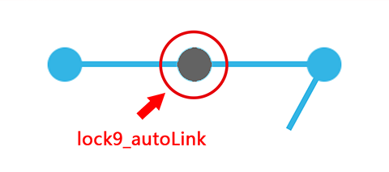

# Limitations

This project has been inactive for a long time, primarily due to limitations in the implementation of the gesture lock layout.

A complete gesture lock layout should include the following functionalities:

- Basic gesture line connections

- Animation for connecting nodes

- States and styles in different situations (colors of nodes and lines in normal, correct, and error states, as well as their duration)

- Layout strategy (number of nodes, touch area, relationship between the layers of lines and nodes)

- Feedback (displaying ripple effects, sound prompts, or vibration feedback when connecting nodes)

I haven’t found a good way to perfectly and elegantly expand all the functionalities mentioned above.

Several of my projects that involve gesture lock requirements were based on this framework but customized the UI for specific modifications.

# Android LockView

An Android grid lock screen view with a callback interface.

## ScreenShot


## Usage

### Add the dependency

``` gradle
        implementation ("com.github.nzdeveloper009:LockView:1.0.0")
```

### Add it in your root build.gradle at the end of repositories:
```
dependencyResolutionManagement {
		repositoriesMode.set(RepositoriesMode.FAIL_ON_PROJECT_REPOS)
		repositories {
			mavenCentral()
			maven { url 'https://jitpack.io' }
		}
	}
```

### Layout example 1

``` xml
<com.nokhaiz.Lock9View
    android:id="@+id/lock_9_view"
    android:layout_width="match_parent"
    android:layout_height="wrap_content"
    android:layout_gravity="center"
    app:lock9_nodeSrc="@drawable/node_normal"
    app:lock9_nodeOnSrc="@drawable/node_active"
    app:lock9_nodeOnAnim="@anim/node_on_1"
    app:lock9_padding="28dp"
    app:lock9_spacing="28dp"
    app:lock9_lineColor="@color/blue_light"
    app:lock9_lineWidth="8dp"
    app:lock9_autoLink="false"
    app:lock9_enableVibrate="true"
    app:lock9_vibrateTime="20" />
```


### Layout example 2

``` xml
<com.nokhaiz.Lock9View
    android:id="@+id/lock_9_view"
    android:layout_width="match_parent"
    android:layout_height="wrap_content"
    android:layout_margin="24dp"
    android:layout_gravity="center"
    app:lock9_nodeSrc="@drawable/node_small_normal"
    app:lock9_nodeOnSrc="@drawable/node_small_active"
    app:lock9_nodeOnAnim="@anim/node_on_2"
    app:lock9_nodeSize="16dp"
    app:lock9_nodeAreaExpand="24dp"
    app:lock9_lineColor="@color/blue_light"
    app:lock9_lineWidth="4dp"
    app:lock9_autoLink="true"
    app:lock9_enableVibrate="true"
    app:lock9_vibrateTime="20" />
```


**PS :**

**If use *"lock9_nodeSize"* , it will ignore *"lock9_padding"* and *"lock9_spacing"*.**

**The nodes will be layout on the center of 9 average areas.**

### Touch area

If you want to draw a small node with a bigger touch area, please user :

```
app:lock9_nodeAreaExpand="24dp"  // default is 0
```

touchArea = lock9_nodeSize + lock9_nodeAreaExpand * 2

### Animation

```
app:lock9_nodeOnAnim="@anim/node_on_2"
```

### AutoLink



```
app:lock9_autoLink="true" // default is false
```

### Vibrate

```
app:lock9_enableVibrate="true"  // default is false
app:lock9_vibrateTime="20"      // default is 20 milliseconds
```

Also need :

``` xml
<uses-permission android:name="android.permission.VIBRATE" />
```

### Activity

``` java
Lock9View lock9View = (Lock9View) findViewById(R.id.lock_9_view);
lock9View.setGestureCallback(new Lock9View.GestureCallback() {

    @Override
    public void onNodeConnected(@NonNull int[] numbers) {
        // Do something
    }

    @Override
    public void onGestureFinished(@NonNull int[] numbers) {
        // Do something
    }

});
```

## Change Log
 
### 0.1.0

- This is a broken api version.

- Extend gesture callback.

## License

```
Copyright 2014 TakWolf

Licensed under the Apache License, Version 2.0 (the "License");
you may not use this file except in compliance with the License.
You may obtain a copy of the License at

    http://www.apache.org/licenses/LICENSE-2.0

Unless required by applicable law or agreed to in writing, software
distributed under the License is distributed on an "AS IS" BASIS,
WITHOUT WARRANTIES OR CONDITIONS OF ANY KIND, either express or implied.
See the License for the specific language governing permissions and
limitations under the License.
```
